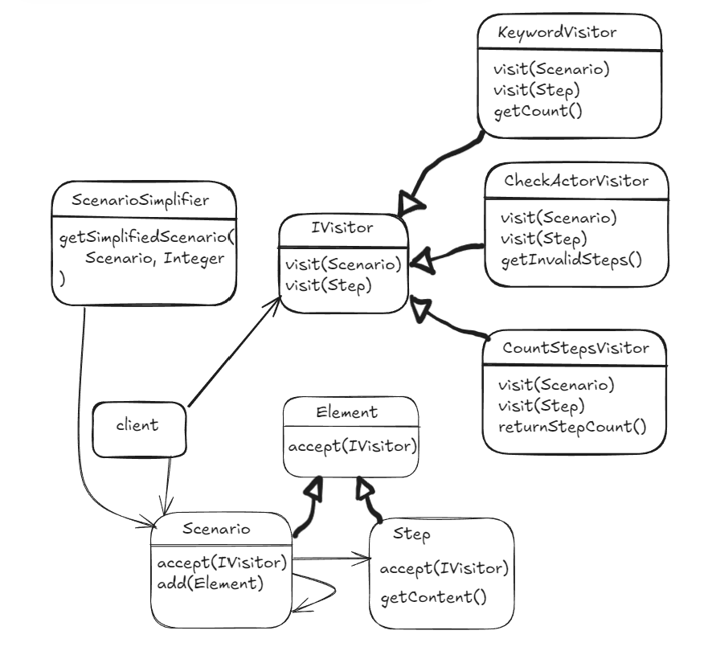

# Scenario Quality Checker (SQC)

Scenario Quality Checker to aplikacja do analizy jakości scenariuszy
wymagań funkcjonalnych zapisanych w formie tekstowej.
System wykrywa problemy strukturalne oraz dostarcza podstawowych miar
opisujących złożoność scenariusza.

Aplikacja udostępnia funkcjonalności przez REST API.

## Funkcjonalność

Aplikacja umożliwia:
- analizę liczby kroków scenariusza (łącznie z pod-scenariuszami),
- wykrywanie kroków zawierających słowa kluczowe IF / ELSE / FOR EACH,
- walidację obecności aktora na początku kroków,
- eksport scenariusza do postaci tekstowej z numeracją,
- uproszczenie scenariusza do zadanego poziomu zagnieżdżenia,
- dostęp do analiz przez REST API.

## Diagram UML

## Członkowie zespołu
* Łukasz Bielaszewski (Scrum Master)
* Konrad Basza (Proxy Product Owner)
* Krystian Czajkowski
* Maksymilian Dzietczyk

